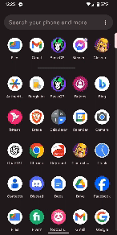

# How to run the project

1. Install dependencies with `yarn install`.
2. Run the project with `yarn android` on an Android device or emulator.

## Output

[Download the apk](https://drive.google.com/file/d/1RGYhHP7XxhsfRb341N4Sc-tduadX3Ujd/view?usp=sharing)
